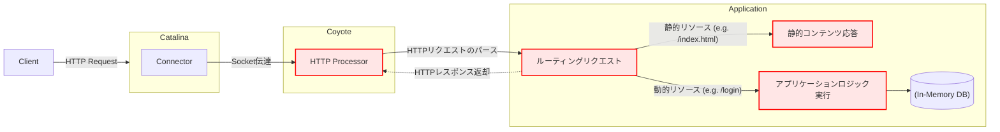

# 自作Tomcat

## プロジェクトの目的

Tomcatの機能の一部を実装することで理解を深める

## アーキテクチャ

クライアントのリクエストからレスポンスまで、サーバー内部でどのように処理されるかを示すアーキテクチャです。Tomcatの主要コンポーネントである`Catalina`と`Coyote`の役割を中心に表現しました。

- **Catalina (コネクションマネージャー)**: サーバー全体のライフサイクルを管理し、クライアントの接続を受け入れて実際のHTTP処理を担当するCoyoteに渡します。
- **Coyote (HTTPプロセッサー)**: Catalinaから受け取った接続(Socket)を利用してHTTPリクエストをパースし、ビジネスロジックを経てレスポンスをSocketを介して出力する役割を担います。

## 実装内容

上記のフローチャートの中で赤色で表現した部分が私が実装した部分です。

具体的には以下の通りです。

### 1. HTTPリクエスト/レスポンスのパース及び管理
- HTTPリクエストのスタートライン、ヘッダー、ボディをパースし、オブジェクト(`HttpRequest`)として管理する機能を実装しました。
- HTTPレスポンスをステータスコード、ヘッダー、ボディで構成し、オブジェクト(`HttpResponse`)として管理し、クライアントに渡す機能を実装しました。
- `HttpMethod`、`HttpStatusCode`のような列挙型を使用してHTTPの仕様を体系的に管理します。

### 2. 静的ファイルレスポンス
- ユーザーのリクエストURIに応じて、`resources/static`ディレクトリにある静的ファイル(HTML, CSS, JSなど)をレスポンスする機能を実装しました。
- ファイルの拡張子を分析し、`Content-Type`ヘッダーを動的に設定します。

### 3. ユーザーログイン及びセッション管理
- `POST /login`リクエストを通じてユーザーログインを処理する機能を実装しました。
- リクエストボディからユーザーアカウント情報をパースし、`InMemoryUserRepository`に保存されている情報と比較して認証を行います。
- ログイン成功時、ユニークなセッションIDをインメモリリポジトリに保存し、`Set-Cookie`ヘッダーを介してクライアントに`JSESSIONID`クッキーを発行し、`Location`ヘッダーを利用してメインページにリダイレクトします。
- ログインに失敗した場合は、再度ログインページにリダイレクトします。
- すでにログインしているユーザー(有効な`JSESSIONID`クッキーを所持しているユーザー)が`/login`ページに再度アクセスすることを防ぐ機能を実装しました。 

## Page Uri

- `/`: hello world! ページ
- `/index.html`: メインページ
- `/login.html`: ログインページ
