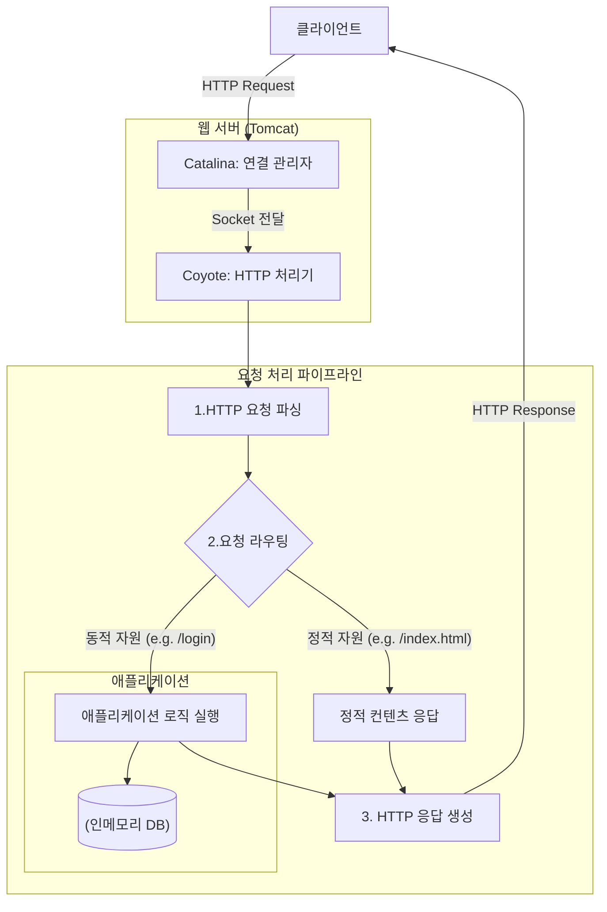

# 톰캣 구현하기

## 프로젝트의 목적

Http 메시지 직접 파싱해서 톰캣 구현해보기

## 아키텍처 플로우

클라이언트의 요청부터 응답까지 서버 내부에서 어떤 흐름으로 처리되는지를 나타낸 아키텍처입니다. Tomcat의 핵심 컴포넌트인 `Catalina`와 `Coyote`의 역할을 중심으로 표현했습니다.

- **Catalina (연결 관리자)**: 서버의 전체적인 생명주기를 관리하고, 클라이언트의 연결을 수락하여 실제 HTTP 처리를 담당하는 Coyote에게 전달합니다.
- **Coyote (HTTP 처리기)**: Catalina로부터 받은 연결(Socket)을 이용해 HTTP 요청을 파싱하고, 비즈니스 로직을 거쳐 최종 응답을 생성하는 역할을 담당합니다.



## 디렉토리 구조 정리

```
tomcat/src/main/java
├── nextstep
│   ├── Application.java (어플리케이션 시작점)
│   ├── custom
│   │   ├── common
│   │   │   └── Cookie.java (쿠키 파싱)
│   │   ├── request (HTTP 요청 관련)
│   │   │   ├── HttpMethod.java
│   │   │   ├── HttpRequest.java
│   │   │   ├── HttpRequestBody.java
│   │   │   ├── HttpRequestHeader.java
│   │   │   ├── HttpRequestLine.java
│   │   │   └── HttpRequestParser.java
│   │   └── response (HTTP 응답 관련)
│   │       ├── HttpResponse.java
│   │       ├── HttpResponseBody.java
│   │       ├── HttpResponseHeader.java
│   │       ├── HttpResponseLine.java
│   │       └── HttpStatusCode.java
│   └── jwp
│       ├── db (인메모리 DB)
│       │   ├── InMemorySessionRepository.java
│       │   └── InMemoryUserRepository.java
│       ├── exception
│       │   └── UncheckedServletException.java
│       └── model
│           ├── Session.java
│           └── User.java
└── org
    └── apache
        ├── catalina
        │   ├── Manager.java
        │   ├── connector
        │   │   └── Connector.java (클라이언트 연결 처리)
        │   └── startup
        │       └── Tomcat.java (Tomcat 서버)
        └── coyote
            ├── Processor.java
            └── http11
                └── Http11Processor.java (HTTP/1.1 요청 처리)
```

## 구현한 것

### 1. HTTP 요청/응답 처리 기반 구축
- HTTP 요청의 시작 줄, 헤더, 본문을 파싱하고 객체(`HttpRequest`)로 관리하는 기능을 구현했습니다.
- HTTP 응답을 상태 코드, 헤더, 본문으로 구성하여 객체(`HttpResponse`)로 관리하고, 클라이언트에게 전달할 수 있는 기능을 구현했습니다.
- `HttpMethod`, `HttpStatusCode`와 같은 열거형을 사용하여 HTTP 명세를 체계적으로 관리합니다.

### 2. 정적 파일 서비스
- 사용자의 요청 URI에 따라 `resources/static` 디렉토리에 있는 정적 파일(HTML, CSS, JS 등)을 응답하는 기능을 구현했습니다.
- 파일 확장자를 분석하여 `Content-Type` 헤더를 동적으로 설정합니다.
- 루트 경로(`/`) 요청 시 `Hello World!`를 응답합니다.

### 3. 사용자 로그인 및 세션 관리
- `POST /login` 요청을 통해 사용자 로그인을 처리하는 기능을 구현했습니다.
- 요청 본문(Body)에서 사용자 계정 정보를 파싱하여 `InMemoryUserRepository`에 저장된 정보와 비교하여 인증을 수행합니다.
- 로그인 성공 시, 고유한 세션 ID를 생성하여 `InMemorySessionRepository`에 저장하고, `Set-Cookie` 헤더를 통해 클라이언트에게 `JSESSIONID` 쿠키를 발급합니다.
- 로그인에 실패하면 다시 로그인 페이지로 리다이렉트합니다.

### 4. 로그인 페이지 접근 제어
- 이미 로그인한 사용자(유효한 `JSESSIONID` 쿠키를 소유한 사용자)가 `/login` 페이지에 다시 접근하는 것을 막는 기능을 구현했습니다.

### 5. 학습 및 테스트 코드
- Gradle 버전을 7.1에서 8.5로 업그레이드했습니다.
- 자바의 파일 I/O 및 멀티스레딩(동기화, 스레드 풀)에 대한 학습 테스트를 완료하여 핵심 개념에 대한 이해를 검증했습니다.

## 고민할 거리

*   **에러 핸들링**: 현재 에러 핸들링은 기본적인 로깅만 하고 있어, 클라이언트에게 적절한 HTTP 에러 응답(예: 404, 500)을 보내도록 개선할 수 있습니다.
*   **코드 중복**: `Http11Processor` 내에 중복된 코드를 별도의 메소드로 추출하여 재사용성을 높일 수 있습니다.
*   **하드코딩된 URL**: 하드코딩된 URL 문자열을 상수로 관리하여 코드의 유지보수성을 향상시킬 수 있습니다.
*   **보안**: 현재 평문으로 전송 및 비교되는 비밀번호를 해싱하여 보안을 강화할 수 있습니다.
*   **동시성**: 매 요청마다 새로운 스레드를 생성하는 현재 방식 대신 스레드 풀을 사용하여 동시성을 관리하고 성능을 개선할 수 있습니다.
*   **모듈화**: `Http11Processor`의 다양한 책임(요청 파싱, 라우팅, 비즈니스 로직 등)을 각각의 클래스로 분리하여 코드의 모듈성을 높일 수 있습니다.
*   **테스트**: 핵심 로직이 포함된 `Http11Processor`와 같은 클래스에 대한 단위 테스트를 추가하여 코드의 안정성을 높일 수 있습니다.