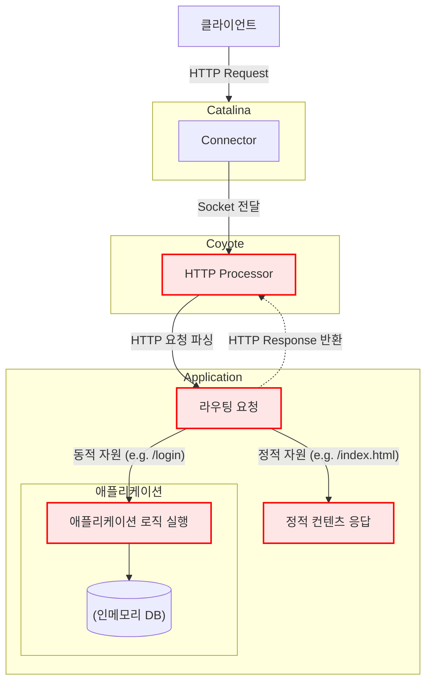

# 톰캣 구현하기

## 프로젝트의 목적

Http 메시지 직접 파싱해서 톰캣 구현해보기

## 아키텍처 

클라이언트의 요청부터 응답까지 서버 내부에서 어떤 흐름으로 처리되는지를 나타낸 아키텍처입니다. Tomcat의 핵심 컴포넌트인 `Catalina`와 `Coyote`의 역할을 중심으로 표현했습니다.

- **Catalina (연결 관리자)**: 서버의 전체적인 생명주기를 관리하고, 클라이언트의 연결을 수락하여 실제 HTTP 처리를 담당하는 Coyote에게 전달합니다.
- **Coyote (HTTP 처리기)**: Catalina로부터 받은 연결(Socket)을 이용해 HTTP 요청을 파싱하고, 비즈니스 로직을 거쳐 최종 응답을 생성하는 역할을 담당합니다.

## 구현한 것

위 플로우 차트 중에서 빨간 색으로 표현한 부분이 제가 구현한 겁니다.

구체적으로는 이하와 같습니다.

### 1. HTTP 요청/응답 처리 파싱 및 관리
- HTTP 요청의 시작 줄, 헤더, 본문을 파싱하고 객체(`HttpRequest`)로 관리하는 기능을 구현했습니다.
- HTTP 응답을 상태 코드, 헤더, 본문으로 구성하여 객체(`HttpResponse`)로 관리하고, 클라이언트에게 전달할 수 있는 기능을 구현했습니다.
- `HttpMethod`, `HttpStatusCode`와 같은 열거형을 사용하여 HTTP 명세를 체계적으로 관리합니다.

### 2. 정적 파일 서비스
- 사용자의 요청 URI에 따라 `resources/static` 디렉토리에 있는 정적 파일(HTML, CSS, JS 등)을 응답하는 기능을 구현했습니다.
- 파일 확장자를 분석하여 `Content-Type` 헤더를 동적으로 설정합니다.
- 루트 경로(`/`) 요청 시 `Hello World!`를 응답합니다.

### 3. 사용자 로그인 및 세션 관리
- `POST /login` 요청을 통해 사용자 로그인을 처리하는 기능을 구현했습니다.
- 요청 본문(Body)에서 사용자 계정 정보를 파싱하여 `InMemoryUserRepository`에 저장된 정보와 비교하여 인증을 수행합니다.
- 로그인 성공 시, 고유한 세션 ID를 생성하여 `InMemorySessionRepository`에 저장하고, `Set-Cookie` 헤더를 통해 클라이언트에게 `JSESSIONID` 쿠키를 발급합니다.
- 로그인에 실패하면 다시 로그인 페이지로 리다이렉트합니다.

### 4. 로그인 페이지 접근 제어
- 이미 로그인한 사용자(유효한 `JSESSIONID` 쿠키를 소유한 사용자)가 `/login` 페이지에 다시 접근하는 것을 막는 기능을 구현했습니다. 

## Page Uri

/: hello world! 페이지
/index.html: 메인 페이지
/login.html: 로그인 페이지